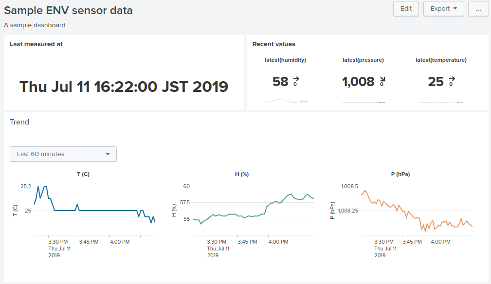

Send M5Stack ENV Module data to Splunk HTTP Event Collector

### Upload to M5stack

Use [ampy](https://github.com/pycampers/ampy).
See also https://ambidata.io/blog/2018/03/15/ampy/

Connect your M5Stack to your host computer.
Enable ampy venv
Put script and config to the M5Stack with ampy
e.g.

```
$ ampy put boot.py
$ ampy put hec.py
$ ampy put bme180.py
$ ampy put dht12.py
$ ampy put config.json
```

### reference libraries
* [`urequests`](https://github.com/micropython/micropython-lib/blob/master/urequests/urequests.py)


## Splunk

You can visualize measured data with Splunk.




### Splunk

```
| mstats avg(_value) span=10min WHERE metric_name=* AND index=atmosphere BY metric_name, host, sensor
```

